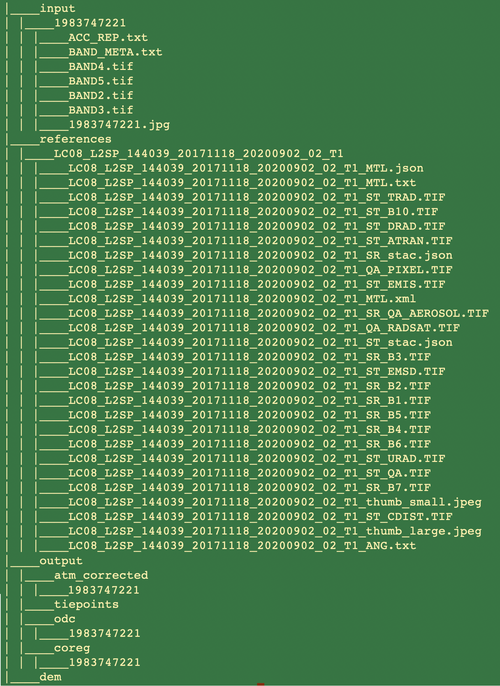

# LISS-III ARD Framework
This repository contains the code for creating a data cube based on the Indian LISS III sensor on a single node. The instructions guide the creation of a spatial data cube on a single compute node. The ARD data generated uses the spatial reference system defined within the Indian national spatial infrastructure standard [EPSG:7755](https://spatialreference.org/ref/epsg/7755/).
The ***data*** folder contains details of the dataset used in the paper. It includes subfolders for ***input***, ***reference***, and ***output***. The __input__ folder contains metadata of the input dataset, while the __reference__ folder has metadata of the reference dataset. The __output__ folder is where processed output files are generated. Actual TIFF images are not provided due to GitHub LFS storage quota constraints. These datasets can be requested by clicking on the dataset links.
Other folders contain codes that facilitate the installation of base software components mentioned in the installation section to build the complete processing chain for LISS-III sensor datasets.

## Pre-Installation preparation
Before installation, pre-installation preparation must be followed to enable the different components of the framework. The framework requires separate environments for each of its components, created using Anaconda software. These environments can be obtained by cloning this repository. Follow these steps in the pre-installation phase:
1. Clone project directory: 
 ```bash
  git clone https://github.com/ashutoshkumarjha/LISSARDFramework.git
 ```
 2. Download  [anaconda](https://enterprise-docs.anaconda.com/en/latest/)
 3. Follow the [instruction](http://docs.anaconda.com/anaconda/install)  to install.

## Installation
To create the spatial data cube based on LISS-III sensors' satellite imagery, follow these steps:
## > Installation of software components
The framework requires creating different software computational environments containing various components of processing frameworks. After successfully installing Anaconda, start the installation of following components
### 1.1 ARCSI
The Atmospheric and Radiometric Correction of Satellite Imagery ([ARCSI](https://github.com/remotesensinginfo/arcsi))  is the geometric correction module..
- CCreate the arosics environment `./arcsi/arcsi.yml`:
```sh
conda env create -f ./arcsi/arcsi.yml
```
- Once the environment is ready, activate the __arcsi__ environment and install arcsi from git repository. This repo contains the modified code to enable the LISS-III sensors.
```sh
git clone https://github.com/ashutoshkumarjha/arcsi.git
cd arcsi
python setup.py install
```
- It will install the arcsi library to the local conda environment `arcsi`

### 1.2. AROSICS
Automated and Robust Open-Source Image Co-Registration Software for Multi-Sensor Satellite Data ([AROSIC]( https://pypi.org/project/arosics/) )  is the geometric correction module.
- Create the `arosics` environment:
```sh
conda env create -f ./AROSICS/arosics.yml
```
### 1.3. Open Data Cube
Open Data Cube ([ODC](https://github.com/opendatacube)) organizes satellite data into a spatial data cube, allowing slicing and dicing of raster data in space and time domains.
- Create the `odc` environment:
```sh
conda env create -f ./ODC/odc.yml
```
- Install Postgres database and create a database `datacube`
- Modify the database credentials and copy the `./ODC/.datacube.conf` to the `{HOME}./.odc/.datacube.conf` directory of the system.
- Activate the environment & initialize the database
```sh
conda activate odc
datacube -v system init
```
- Deactivate the environment
```sh
conda deactivate
```

## > Input dataset processing
The `input` folder contains datasets including input and reference images organized into respective folders. Input files must be extracted into the `input` folder. For example, L1 LISS III data is stored in `./data/input/1983747221/*` with details of input images used in this work. Reference images used during co-registration, such as Landsat 8, are stored in `./data/references/LC08_L2SP_144039_20171118_20200902_02_T1`.

These data sets can be requested on using by clicking the Download link.
 - Download input LISS-III images([1983747221](https://iirsgovin-my.sharepoint.com/:u:/g/personal/akjha_iirs_gov_in/EeuM2EvaWIlGhzZt84UZ7KEB2SVn8eiQ9SjMOSG5WFvAbQ),[1983747261](https://iirsgovin-my.sharepoint.com/:u:/g/personal/akjha_iirs_gov_in/ETplpZvVhsNLr_2EigLhBPsBfpgEXRGpESYB0Am0GOLLCg) & extract into directories `./data/input/1983747221/` and `./data/input/1983747261/` 
 - Download Landsat-8-Reference images for given input images [[1983747221](https://iirsgovin-my.sharepoint.com/:u:/g/personal/akjha_iirs_gov_in/EbUAeZWhyoJApqyFY_KLKJIBAHIuD7-cPz6T8yge9rUo9Q),[1983747261](https://iirsgovin-my.sharepoint.com/:u:/g/personal/akjha_iirs_gov_in/ETplpZvVhsNLr_2EigLhBPsBfpgEXRGpESYB0Am0GOLLCg)] & copy or create symbolic link to the reference image to the `./data/input/1983747221/ref/` and `./data/input/references/1983747261/` directories.
 - Add empty directories `atm_corrected/1983747221` & `atm_corrected/1983747261` and `coreg/1983747221` & `coreg/1983747261`  inside `./data`  folder.
 - Sample directory structure corresponding to [1983747221](https://iirsgovin-my.sharepoint.com/:u:/g/personal/akjha_iirs_gov_in/EbUAeZWhyoJApqyFY_KLKJIBAHIuD7-cPz6T8yge9rUo9Q) is as shown below:
 
## 2.1. Atmospheric Correction
- Activate the `arcsi` conda environment
```sh
conda activate arcsi
```
- Once the input images `BAND[2-5]` are downloaded into directories `./data/input/1983747221/`, `./data/input/1983747261/`run the following arcsi command to start atm correction module. It will generate .kea files for radiance, toa & surface reflectance values.
```sh
arcsi.py -s L3 -f KEA --stats -p RAD TOA SREF --aeropro NoAerosols --atmospro NoGaseousAbsorption --aot 0.5 -o "./data/atm_corrected/1983747221/" -i "./data/input/1983747221/BAND_META.txt"
```
- Reproject and convert the data into tiff file
```sh
gdalwarp -t_srs 'EPSG:7755' "./data/atm_corrected/1983747221/L3_20171120_latn812lone310_r49p99_vmsk_rad_sref.kea" "./data/atm_corrected/1983747221/L3_20171120_latn812lone310_r49p99_vmsk_rad_sref_7755.tif"
```
- Deactivate the environment
```sh
conda deactivate
```

## 2.2. Geometric Correction
- Activate the `arosics` environment
```sh
conda activate arosics
```
- Run the python script provided for image registration `img_reg.py`
```sh
python ./AROSICS/img_reg.py
```
- Deactivate the environment
```sh
conda deactivate
```

## 2.3. Data Ingestion to ODC
- Activate the `odc` environment
```sh
conda activate odc
```
- Generate `product.yml` (or modify & use the sample `./ODC/product.yml` provided) & add the product definition to the datacube (one time operation)
- A python script is provided to generate the product YAML file. Modify the content according to the sensor requirement and run the script `./ODC/generate_pdef.py`
```sh
python ./ODC/generate_pdef.py
```
- Add the product to the datacube
```sh
datacube product add ./ODC/product.yml
```
- Similarly, script for generating dataset YAML is provided `./ODC/generate_ds.py`. Modify and run the script. __Note__You can also use the sample `./ODC/dataset.yml` provided.
```sh
python ./ODC/generate_ds.py
```
- Add the dataset to the database
```sh
datacube dataset add ./ODC/dataset.yml
```
- Finally, ingest the added datasets using  `./ODC/ingest.yml`. __Note__Please, make sure to update the ingestion directory in the yaml file.
```sh
datacube ingest -c ./ODC/ingest.yml
```
- Deactivate the environment
```sh
conda deactivate
```
## Notes
The use of DEM and modification of ARCSI input parameters can improve the corrected output.

# Contributing
Pull requests are welcome. For major changes, please open an issue first to discuss what you would like to change.
Please make sure to update tests  as necessary.

# Authors
* Ashutosh Kumar Jha 

# Citation
### Software
@misc{Jha2024,
  author = {Jha, Ashutosh Kumar},
  title = {LISS-III ARD Framework (*LISSARDFramework*)},
  year = {2024},
  publisher = {GitHub},
  howpublished = {\url{https://github.com/ashutoshkumarjha/LISSARDFramework}},
  note = {GitHub repository}
}
### Paper
@article{Jha2024,
   author = {Ashutosh Kumar Jha and Sanjay Kumar Ghosh and Sameer Saran},
   doi = {10.1007/s12524-024-01928-9},
   issn = {0255-660X},
   journal = {Journal of the Indian Society of Remote Sensing},
   month = {6},
   title = {A Computation Framework for LISS-III Analysis Ready Data (ARD) Products for Indian Spatial Data Cube Generation},
   url_doi = {https://link.springer.com/10.1007/s12524-024-01928-9},
   url = {https://rdcu.be/dMr2d}
   year = {2024}
}


# License
[GPL](https://www.gnu.org/licenses/gpl-3.0.en.html)


